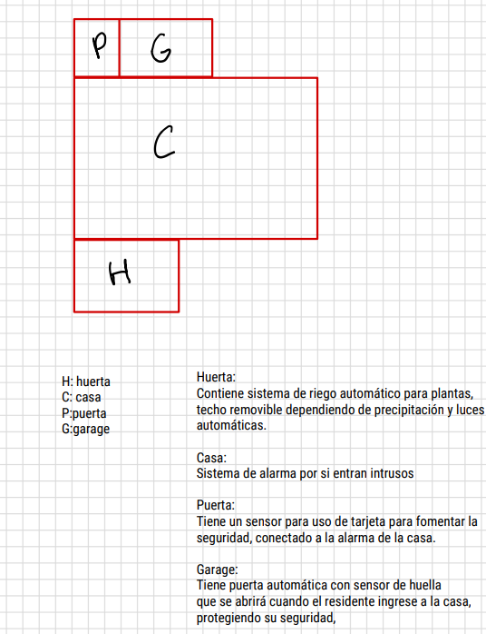

# Entregable-SMIC
Repositorio con el entregable de la clase de hoy.

Nombre del proyecto: CasaNova

Integrantes: Paula Alejandra Morales Lombana - Daniel Andres Valderrama - Duvan Manuel Tobar

Descripcion del proyecto: El proyecto consistira en mostrar como un hogar se puede transformar a un hogar inteligente por medio de la automatizacion y uso de sensores, controles y llevarlo a un ambiente IoT el cual permita mantener seguridad, facilidad y un control en cualquier momento del hogar.

Para este proyecto se usaran sensores de proximidad, bombas de agua, sensores de humedad y calor, junto a LEDs RGB para mostrar el estado en el que se encuentra. La apertura de las puertas se dara por medio de unos sensores y modulos RFID para que a la proximidad pueda desbloquearse.
Cada uno de los datos y estados de las partes de la casa se veran reflejados en Node-Red, en donde se podran activar ciertas acciones para automatizar a distancia el hogar.

Los avances actuales se han fundamentado en la union de varios codigos para generar el primer codigo principal que automatice la casa inteligente. Se hizo uso de librerias especiales para los sensores RFID o el rele de la bomba de agua junto al sensor de humedad. Asi mismo tambien se implementaron funciones nuevas como las del movimiento del servomotor o las de la deteccion de cada elemento en el codigo con una respuesta a la pagina que se encuentra en NODE-RED. En el siguiente diagrama se encuentra el estado actual de las conexiones y como van conectadas a cada microcontrolador que generen sus respuestas al servidor.

Asi mismo en el apartado de main.ino se encuentra tanto el codigo que contiene a los lectores con la bomba de agua y el sensor de humedad, junto a otro codigo el cual contiene todo el funcionamiento de los servomotores para la apertura del techo y el riego de las plantas en la huerta.